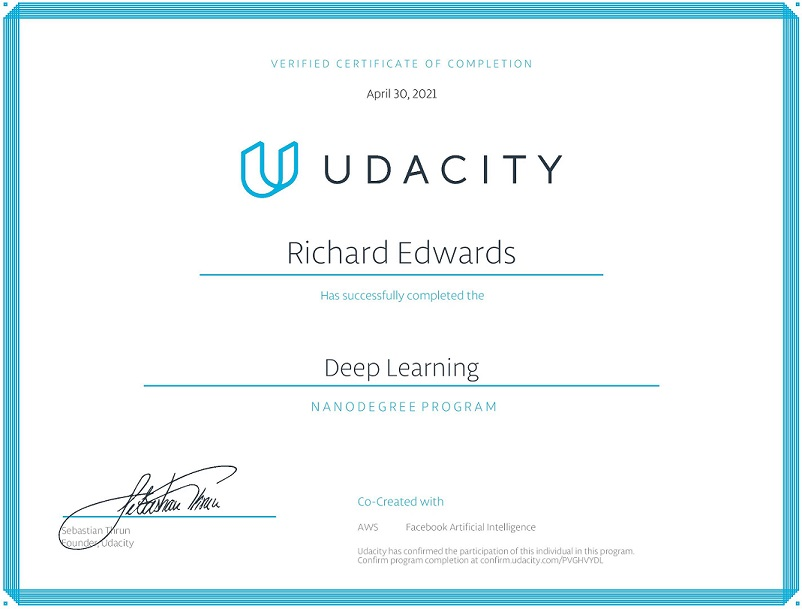

# [Deep Learning Nanodegree](https://www.udacity.com/school-of-data-science)  

This repository contains some my work from the Deep Learning with pytorch Udacity NanoDegree.

## Course 1

### Introduction to Deep Learning

Introduce yourself to deep learning by applying style transfer to your own images, and gaining experience
using development tools such as Anaconda and Jupyter notebooks.

## Course 2

### Neural Networks

Learn neural network basics, and build your first network with Python and NumPy. Use the modern deep learning framework PyTorch to build multi-layer neural networks, and analyze real data

#### Lessons: 
Neural Networks, Implementing Gradient Descent, Training Neural Networks, Sentiment Analysis

### Course Project: [Predicting Bike-Sharing Patterns](https://github.com/riched158/SQL-nano/tree/main/proj2)  
Build and train your own Neural Network from scratch to predict the number of bikeshare users on a given day.

## Course 3

### Convolutional Neural Networks

Learn how to build convolutional networks and use them to classify images (faces, melanomas, etc.) based on patterns and objects that appear in them. Use these networks to learn data compression and image denoising.

#### Lessons: 
CNNs, Cloud Computing, Transfer Learning, Weight Initialisation, Autoencoders, Style Transfer

### Course Project: [Dog-Breed Classifier](https://github.com/riched158/SQL-nano/tree/main/proj2)  
In this project, you will learn how to build a pipeline to process real-world, user-supplied images. Given an
image of a dog, your algorithm will identify an estimate of the canine’s breed

## Course 4

### Recurrent Neural Networks

Build your own recurrent networks and long short-term memory networks with PyTorch; perform sentiment analysis and use recurrent networks to generate new text from TV scripts.

#### Lessons: 
Recurrent Neural Networks, LSTMs, Implementation of RNN & LSTM, Hyperparameters, Embeddings & Word2Vec, Sentiment Prediction RNN

### Course Project: [Generate TV Scripts](https://github.com/riched158/SQL-nano/tree/main/proj2)  
Generate a TV script by defining and training a recurrent neural network

